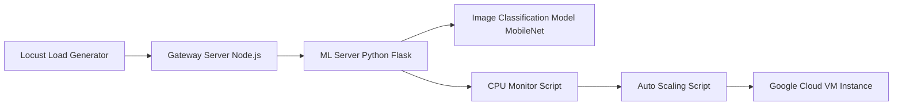

# Hybrid Cloud Auto-Scaling ML System

## Project Overview

This project demonstrates a **hybrid cloud architecture** where an on-premise Machine Learning system automatically scales to the cloud when system load increases.

The system monitors CPU usage on a local VM. When the CPU utilization exceeds **75%**, a new compute instance is automatically launched on **Google Cloud** to handle additional workload.

The project simulates real-world scenarios where on-premise infrastructure dynamically expands into the cloud during high demand.

---

# System Architecture



---

# Components

## Gateway Server

* Built using **Node.js**
* Provides the web interface for image upload
* Receives requests from users
* Forwards images to the ML server for prediction

## ML Server

* Built using **Python Flask**
* Loads the MobileNet deep learning model
* Performs image classification on uploaded images

## CPU Monitor

* Implemented using `psutil`
* Continuously monitors CPU utilization
* When CPU usage exceeds **75%**, the scaling script is triggered

## Cloud Scaling

* Uses **Google Cloud CLI**
* Automatically launches a new VM instance in Google Cloud
* Demonstrates hybrid cloud auto-scaling

## Load Testing

* **Locust** is used to simulate multiple users
* Generates heavy load on the system
* Helps demonstrate the auto-scaling mechanism

---

# Project Structure

```
cloud-auto-scaling-ml-system

gateway_server/
Node.js gateway server
Handles client requests

ml_server/
ML inference server
CPU monitoring script
Cloud scaling script

locust_test/
Load testing using Locust

README.md
Project documentation
```

---

# Setup Instructions

## 1. Install Python Dependencies

```
pip install flask torch torchvision psutil
```

## 2. Install Node Dependencies

```
cd gateway_server
npm install
```

---

# Running the System

## Start ML Server

```
cd ml_server
python app.py
```

## Start CPU Monitor

```
python monitor.py
```

## Start Gateway Server

```
cd gateway_server
node app.js
```

---

# Load Testing with Locust

Run the Locust test:

```
locust -f locust_test/locustfile.py
```

Then open the Locust web interface:

```
http://localhost:8089
```

Generate multiple users to simulate heavy load.

---

# Auto-Scaling Behavior

1. Locust generates heavy traffic.
2. Gateway server forwards requests to ML server.
3. CPU usage increases.
4. When CPU usage exceeds **75%**, the monitoring script triggers cloud scaling.
5. A new VM instance is launched on Google Cloud.

---

# Technologies Used

* Python
* Flask
* PyTorch
* Node.js
* Locust
* Google Cloud CLI
* psutil
* VirtualBox

---

# Author

Rajat Chaddha
M.Tech Artificial Intelligence
